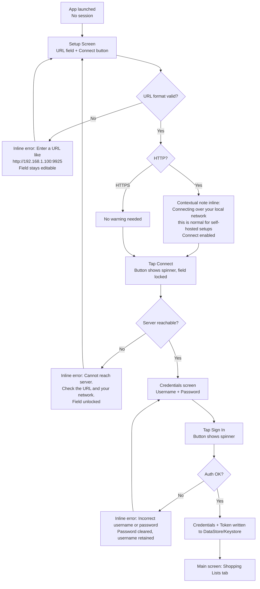
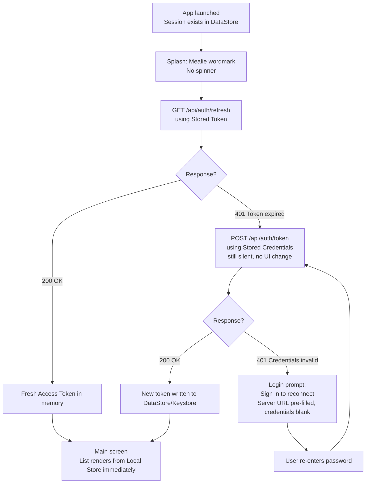
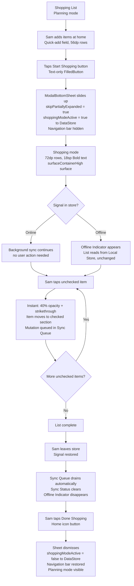
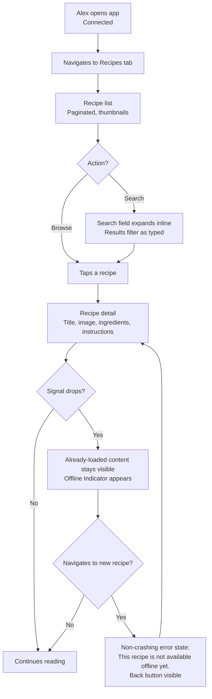

# UX Design Specification mealie-android-unofficial

**Author:** Xexanos
**Date:** 2026-05-22

---

<!-- UX design content will be appended sequentially through collaborative workflow steps -->

## Executive Summary

### Project Vision

Mealie Android is a native Android client for self-hosted Mealie instances. The design north star:
the app should feel exactly like Mealie's web interface, with one silent addition — connectivity
is no longer a constraint. That difference is invisible when everything works, and total when it
does not.

The product succeeds when Sam opens her shopping list in the supermarket and it is simply there —
no spinner, no login prompt, no uncertainty. Everything else is scaffolding toward that moment.

### Target Users

**Alex (Operator):** Technically confident, runs the Mealie server, sets up the app for others.
Comfortable with URL/credentials entry. Likely to be the one who shares access with household
members.

**Sam (Passenger):** Uses Alex's Mealie instance. May have no mental model of "self-hosted server."
Wants a shopping list that works. Needs Alex to hand her a configured experience, not a URL field
and a set of instructions.

Both users share identical ongoing needs. The divergence is at setup only.

### Key Design Challenges

1. **Passenger onboarding is a trust problem, not a URL problem.** Sam should not need to
   understand what a server URL is. The first-launch flow should be designed around Alex sharing
   access — QR code or deep link (post-v1) is the real solution; for v1, the URL field must at
   minimum be copy-paste friendly and framed in plain language.

2. **The "is this list right?" moment is the core trust problem.** The design must answer the
   question Sam has every time she opens the app in the supermarket: is what I'm looking at
   current? This is harder than offline handling — it is about perceived trustworthiness of the
   data, regardless of connectivity state.

3. **Sync state must be aggregated, not per-item.** Three badge states per Shopping List Item
   (pending/syncing/error) creates visual noise under supermarket conditions. The correct model:
   one aggregate list-level indicator (subtle when synced, amber when pending, red when error).
   Per-item surfacing only for items requiring user action (e.g. a sync error that needs
   resolution).

4. **The Shopping List serves two contexts: home (plan/edit) and store (execute).** Design must
   serve both. At home: think-and-organize, full signal, deliberate edits. In store: glance-and-
   tap, one hand, patchy signal. Typography and layout choices should work across both; Shopping
   Mode differentiation (if implemented) should come from layout and type, not a full color-
   scheme switch.

5. **HTTP security warning is a copy problem.** The audience knows they are on a self-hosted local
   network. The warning must normalize the situation, not alarm: "You're connecting over your home
   network — this is common for self-hosted setups." Written for Sam; Alex will understand it
   regardless.

### Design Opportunities

1. **Offline-first as the primary render path.** The app opens the Shopping List from Local Store
   with zero network round-trip. This is not a fallback — it is the default. The app is
   trustworthy before a single API call completes.

2. **Shopping List visual hierarchy as a differentiator.** Unchecked items bold and full-contrast.
   Checked items faded (40% opacity + strikethrough) and visually silent. Minimum 18sp item text.
   Large tap targets. The list passes the 3-second glance test in a supermarket.

3. **Shopping Mode as layout, not color.** When the user enters a Shopping List, strip the bottom
   navigation bar (full-screen tool mode), use a subtly elevated Material 3 surface, and increase
   type scale. The visual shift signals "you are now in working mode" without a jarring dark/light
   flip. Respects the user's system theme.

4. **Material 3 as the visual foundation.** Mealie's web UI is Material-aligned. Using Material 3
   tonal surfaces and type scale gives visual coherence with the web interface without inventing a
   new design language.

## Core User Experience

### Defining Experience

The Shopping List is the heart of the app, and it serves two distinct jobs that deserve two
distinct designs.

**Planning mode** is the default state: building the list at home, adding items, editing
quantities, reviewing what's needed. Both hands, full attention, deliberate input.

**Shopping mode** is activated when the user heads to the store: full-screen, large type,
single-tap check-off, no distractions. One hand, partial attention, fast execution.

The switch between modes is always within reach — a prominent "Start Shopping" button on the
Planning screen, a "Done Shopping" button on the Shopping screen. No nav bar required to flip
between them. The active mode is persisted: if Sam closes the app mid-trip and reopens it,
she is back in Shopping mode exactly where she left off.

Adding items is a home activity. In the store, the list is read-and-execute. This distinction
drives the design of each mode.

### Platform Strategy

- Native Android (Kotlin + Jetpack Compose), touch-first, API 26+
- Offline-first: the Local Store is the primary data source; network is a sync mechanism, not
  a requirement for access
- Single-hand operation assumed for all Shopping mode interactions; two-hand assumed for
  Planning mode
- Material 3 design system — consistent with Mealie's web interface visual language
- No platform-specific hardware features required (no camera, no NFC, no GPS)

### Effortless Interactions

The following interactions must require zero conscious effort:

1. **Opening the app and seeing the list immediately.** No spinner, no skeleton, no loading
   state — the Shopping List renders from Local Store before any network call completes.
   The app is usable in under one second regardless of connectivity.

2. **Checking an item off (Shopping mode).** One tap. Instant visual response — item fades
   to 40% opacity with strikethrough and moves to the checked section. No confirmation, no
   undo prompt, no delay.

3. **Switching between Planning and Shopping mode.** One tap from within the Shopping List
   screen — no nav bar, no back stack, no context switch. The transition is immediate.

4. **Silent authentication.** Token refresh, credential fallback, and 401 recovery all happen
   invisibly. The user never sees a login screen unless their Mealie password has changed.

5. **Sync on reconnect.** When connectivity returns, the Sync Queue drains automatically.
   No user action required unless something goes wrong.

### Critical Success Moments

1. **The first open in the supermarket (Shopping mode).** Sam opens the app with no signal.
   Shopping mode is active from her last session. Her list appears immediately, large and
   readable, complete and correct. This is the moment the app earns permanent trust.

2. **The first invisible server update.** Alex updates Mealie. Sam opens the app the next
   day and lands directly on her content, no login prompt. That invisibility is the success.

3. **Setup completion for a Passenger.** Sam enters the server URL and credentials and
   reaches the main screen without confusion. Completable without Alex present to explain it.

4. **First sync after an offline shopping trip.** Sam leaves the supermarket, signal
   restored. Within 30 seconds, all her check-offs appear in the Mealie web interface.
   The household coordination loop closes silently.

### Experience Principles

1. **Trust before delight.** The app must be reliable before it is beautiful. A list that
   is always there, always current, and never loses data earns more loyalty than any visual
   flourish. Reliability is the UX.

2. **Invisible infrastructure.** Auth, sync, and connectivity management are plumbing.
   Surface only what requires user attention; hide everything else.

3. **The list is the product.** The Shopping List screen receives the most design
   investment. It opens instantly, serves two deliberately designed modes, and is
   optimized for its context — Planning for home, Shopping for the store.

4. **Two modes, one switch.** Planning mode and Shopping mode are distinct surfaces with
   distinct visual treatments, but transition between them is always one tap from within
   the list. No nav bar required, no back stack navigated, no context lost.

5. **Aggregate, don't annotate.** Sync state, connectivity status, and error conditions
   are communicated at the screen level, not the item level. Per-item annotation is
   reserved for situations requiring explicit user action. Noise is a trust cost.

## Desired Emotional Response

### Primary Emotional Goals

**Calm confidence** is the primary emotional target — not excitement, not delight-with-sparkles.
The feeling of picking up a tool that has never let you down. The app earns trust by being
invisible when it works and clear when it doesn't.

### Emotional Journey Mapping

| Moment | Target emotion | How |
| --- | --- | --- |
| First launch (Alex) | Competent, in control | Setup is short, clear, and asks only what it needs |
| First launch (Sam) | Not overwhelmed | Plain language, no technical jargon, one step at a time |
| In the supermarket | Calm focus | Large readable list, one-tap check-off, nothing in the way |
| After a server update | Nothing — invisible | No login prompt, no interruption, app just opens |
| Offline with list available | Mild reassurance | Indicator says "I've got this", not "something is wrong" |
| Sync failure | Controlled concern | One clear message, one obvious action, user feels informed not helpless |

### Micro-Emotions

- **Confidence over confusion** — every screen answers the question "what do I do next?" without the user having to ask
- **Trust over skepticism** — the list renders immediately from Local Store; the app does not make users wonder if it is working
- **Satisfaction over frustration** — checking an item off is tactile and instant; the interaction has weight
- **Calm over anxiety** — the offline state is communicated as a normal operating condition, not a failure

### Design Implications

- **Calm confidence** → clean layouts, generous whitespace, no competing elements for attention; visual calm communicates the app is in control
- **Trust** → instant render from Local Store, aggregate sync indicator always visible, no spinners where cached data can be shown
- **Satisfaction on check-off** → the checked state is visually distinct and immediate (fade + strikethrough); the item visibly "leaves" the active list
- **Not overwhelmed (Sam)** → setup flow uses plain language, one field at a time, no technical terms without explanation
- **Controlled concern on error** → error states use amber/red only for the aggregate indicator and specific actionable items; no full-screen error states for recoverable conditions

### Emotional Design Principles

1. **Calm is a feature.** Visual restraint — no badges, animations, or alerts that aren't load-bearing — communicates that the app is handling complexity on behalf of the user.
2. **Reassure through presence, not apology.** The offline indicator and sync state exist to reassure, not to apologise. Framing matters: "changes saved locally" not "you are offline."
3. **Earn the right to be ignored.** The goal is for users to stop noticing the app's infrastructure entirely. Every time a token refreshes silently or a sync completes in the background, the app earns another moment of invisibility.

## UX Pattern Analysis & Inspiration

### Inspiring Products Analysis

**ColorNote** — Shopping mode reference
ColorNote's checklist UX is the closest existing analogue to Shopping mode: full-screen list,
minimal chrome, large tap targets, fast check interaction. Its in-list drag-to-reorder is the
right pattern for Planning mode (deliberate reorganization). For Shopping mode, ColorNote
informs the quick sort approach — a lightweight sort menu rather than drag handles, since
you are executing against the list, not curating it.

**Home Assistant Todo** — Planning mode reference
Home Assistant's todo list demonstrates the two-speed add pattern: a quick-add field pinned
at the top of the list for fast entry (label only, press enter, done), and a full detail
dialog for structured input (label, quantity, unit, category). Crucially, the same dialog
serves both new items and edits — pre-populated when editing. Tapping an existing item drops
directly into edit mode without a separate "edit" toggle. This is the right model for Planning
mode's add and edit flows.

**Spotify Now Playing** — mode transition aesthetic reference
The Spotify Now Playing screen establishes the zoom-in overlay model: a full-screen surface
slides up from the context below, optimized for a single task. Swipe down to return. The
parent screen is always underneath — it is not a navigation push, it is a layer. This is the
right metaphor for Planning to Shopping mode transition: the user zooms into the list for
execution, then zooms back out to planning.

**Google Maps Navigation** — mode transition clarity reference
Google Maps contributes the entry and exit clarity that the Spotify model lacks on its own:
an explicit "Start Shopping" entry point that tells the user exactly what they are activating,
and a visible exit affordance in the execution surface. Combined with Spotify's aesthetic,
this gives users who need an explicit control ("Done Shopping" chip) and users who prefer
the gesture (swipe down) both a path out.

### Transferable UX Patterns

**Mode transition — Spotify overlay + Google Maps clarity**
Shopping mode slides up as a full-screen Material 3 bottom sheet from the Planning screen.
Entry: "Start Shopping" button on the Planning view. Exit: drag handle pill at the top
(swipe down to dismiss) plus a small "Done Shopping" chip in the top bar. The overlay
metaphor makes it clear that Planning mode is underneath — not replaced.

**Two-speed add (Home Assistant)**
A quick-add text field pinned at the top of the list handles the fast case (label only,
enter to confirm). A full add/edit dialog handles structured input (label, quantity, unit,
category from Mealie label data). Both modes support quick add; the full dialog is
Planning mode only. The same dialog pre-populates for edits — tapping an item in Planning
mode opens it directly.

**Quick sort in Shopping mode (ColorNote)**
A sort menu in the Shopping mode top bar offers three options: Unsorted (server order),
Alphabetical, By Category. No drag handles in Shopping mode — sorting is a quick decision
made before starting to shop, not an ongoing reorganization. Drag-to-reorder lives in
Planning mode only.

**Drag-to-reorder in Planning mode (ColorNote)**
Long-press or a visible drag handle on each item row in Planning mode enables manual
reordering. This is the deliberate curation tool — used at home, not in the store.

### Anti-Patterns to Avoid

- **Navigation push for mode switch** — pushing Shopping mode onto the back stack makes it
  feel like a separate screen and breaks the overlay metaphor. The back gesture should
  dismiss Shopping mode to Planning, not navigate back in history.
- **Category grouping in Shopping mode** — grouping by category adds cognitive load during
  execution. A flat list with optional sort is sufficient; the user chooses the order once
  before starting, then executes.
- **Full add dialog in Shopping mode** — the in-store add case is "someone texted me to
  grab X." A label-only quick add is sufficient. The full dialog is one swipe down away
  in Planning mode.
- **Swipe-only exit from Shopping mode** — a gesture-only exit is a discoverability trap
  for new users. The "Done Shopping" chip provides an explicit fallback.
- **Per-item sync metadata during shopping** — aggregate sync state at the list level,
  not the item level. No badges or icons cluttering the execution view.

### Design Inspiration Strategy

**Adopt directly:**
- Home Assistant's two-speed add pattern (quick field + full dialog, same dialog for edit)
- Spotify's overlay/zoom-in transition model
- ColorNote's minimal-chrome Shopping mode aesthetic
- Google Maps' explicit named entry point ("Start Shopping")

**Adapt for context:**
- ColorNote's sort: simplify to three preset options (no drag in Shopping mode)
- Google Maps' exit: downsize to a chip rather than a full button row
- Home Assistant's edit: add Mealie-specific fields (quantity, unit, category label)

**Avoid:**
- Any pattern that requires the user to understand the sync architecture
- Any add flow in Shopping mode that requires more than a text field and a confirmation
- Navigation patterns that make Planning and Shopping mode feel like separate destinations

## Design System Foundation

### Design System Choice

**Material Design 3 (Material You)** — `androidx.compose.material3`

### Rationale for Selection

- Kotlin + Jetpack Compose ships Material 3 components out of the box — no additional
  libraries, no friction
- Mealie's web interface uses Vuetify (Material-aligned) with brand color `#E58325` —
  Material 3 seeded from the same orange gives visual coherence users recognize without
  pixel-matching the web UI
- Accessibility built in: contrast ratios, touch targets, focus handling
- Tonal surface system directly supports Shopping mode elevation: `surfaceContainerLow`
  for Planning mode, `surfaceContainerHigh` for Shopping mode overlay
- Dynamic Color (Material You) handles light/dark mode automatically on Android 12+
- Single-developer project: a custom design system would be ongoing maintenance overhead
  with no clear benefit

### Color Strategy

**Seed color: `#E58325`** (Mealie's official brand orange)

`#E58325` is high-chroma amber-orange. As a Material 3 seed it is tamed by the tonal
palette algorithm: surfaces become warm off-whites, containers become soft amber-cream.
Raw orange appears only as punctuation — primary buttons, FABs, active navigation
indicators, the adaptive icon. It never touches large background areas or reading surfaces.
The result is a warm, calm resting state with brand recognition at the door.

**Rule:** never use `Color(0xFFE58325)` directly in the codebase. Always reference
`MaterialTheme.colorScheme.primary` and let the tonal system handle role assignment.

Dynamic Color on API 31+ may vary from the static palette. The static fallback (API 26-30)
is the fully deterministic brand-consistent experience; test both branches explicitly.

### Shopping Mode Transition — ModalBottomSheet

**Decision:** `ModalBottomSheet` (not a Navigation Compose route).

Planning mode and Shopping mode are two states of the same place — one layered above the
other. `ModalBottomSheet` encodes this spatially: the planning view is physically beneath
the sheet in Z-order during the transition. The user sees it. That is the Spotify zoom-in
model, delivered structurally rather than simulated with animation curves.

**Implementation specifics:**
- `skipPartiallyExpanded = true` — load-bearing; without it the sheet lands half-expanded
- `containerColor = MaterialTheme.colorScheme.surfaceContainerHigh`
- `dragHandle = { DragHandle() }` — built-in pill, no custom component needed
- Back gesture handled internally via `BackHandler` — semantics are "dismiss overlay,"
  not "navigate back in history." On Android 13+ predictive back, the sheet collapses
  during the swipe preview, reinforcing the mental model
- `surfaceContainerHigh` requires `androidx.compose.material3 1.2.0+`
- Hoist `shoppingModeActive` state above the NavHost, not inside the list destination
- Persist mode to DataStore as a single boolean; `LaunchedEffect` on screen entry reads
  the value and calls `sheetState.show()` if true — no flash on app restore
- Deep links and multi-list (post-v1): handled via `LaunchedEffect` reading intent
  parameters, then calling `sheetState.show()` — no structural migration required

### Customization Strategy

Minimal on top of stock Material 3:

- Color seed `#E58325` — static `lightColorScheme`/`darkColorScheme` fallback for API
  26-30; `dynamicColorScheme` on API 31+
- Typography: `titleMedium.copy(fontSize = 18.sp)` for Shopping mode item text
- No third-party UI libraries

### Implementation Approach

Single `MealieTheme.kt` composable at app root. API version gate for Dynamic Color.
`ModalBottomSheet` for Shopping mode overlay. No custom design tokens, no raw color
references outside the theme wrapper.

## Core User Experience — Defining Experience

### Defining Experience

The defining experience of mealie-android-unofficial is not a gesture or an interaction —
it is a moment of quiet reliability: Sam opens the app in the supermarket and her Shopping
List is simply there. Instantly. Without a spinner, a login prompt, or any signal required.

That moment, repeated reliably on every shopping trip, is the product's core promise. Every
architectural and UX decision in this specification exists to make it happen.

### User Mental Model

Users arrive with two mental models pulled from existing experience:

**The PWA mental model (what they're leaving):**
The Mealie PWA sometimes works and sometimes doesn't. After a server update it shows a
login screen. Without signal it shows a blank screen. Users have learned to distrust it —
they keep the app open, avoid navigating away, hunt for signal before opening it. The
mental model is: "this might not work."

**The native app mental model (what we're building toward):**
Native apps used regularly are expected to work. Offline-first apps like Spotify are
expected to have content ready. The mental model we are training: "it will be there."
Users should never consider whether the app will work. The transition from the first mental
model to the second happens at the first open in the supermarket. If the list is there,
instantly, the old model is replaced. If it isn't, it is reinforced and trust is lost.

### Success Criteria

The core interaction succeeds when:

1. **The list renders before the keyboard animation completes.** Local Store read on
   launch; no network call required for first paint.
2. **Sam checks an item off and it feels tactile.** The item fades and moves in under
   200ms. No confirmation, no delay.
3. **Sam closes and reopens the app mid-trip and nothing changes.** Shopping mode is
   active, the list is in the same state, no flash, no navigation. Continuity.
4. **Sam finishes shopping and walks out of the store.** Sync happens automatically.
   She does not know it happened. She takes no action.

### Pattern Analysis

**Established patterns — adopted directly:**
- Checklist with checked items visually separated (universal, no learning required)
- Tap to check/uncheck (universal)
- Swipe-down to dismiss an overlay (established on Android via bottom sheets)
- Quick-add text field at top of list (Home Assistant, Todoist, Reminders)

**Novel pattern — requires orientation:**
The Planning / Shopping mode switch. No mainstream app has a named mode switch on a
shopping list screen. The "Start Shopping" button is the teacher — its label tells the
user exactly what they are doing. The drag handle on the sheet teaches the dismiss
gesture. After one use, the pattern is understood.

### Experience Mechanics

**The check-off (primary interaction):**
1. *Initiation:* Unchecked item, full-contrast, 18sp minimum, large tap target
2. *Interaction:* Single tap anywhere on the item row
3. *Feedback:* Item fades to 40% opacity, strikethrough appears, animates to checked
   section — all within 200ms. Sync Status Badge appears briefly if offline
4. *Completion:* Item is in the checked section; if connected, sync is queued silently

**The Planning to Shopping mode transition:**
1. *Initiation:* "Start Shopping" button visible at the bottom of the Planning screen
2. *Interaction:* Single tap; Shopping mode sheet slides up from below
3. *Feedback:* Planning view visible beneath the rising sheet; `surfaceContainerHigh`
   signals the mode change; drag handle pill visible at top
4. *Completion:* Full-screen Shopping mode active; large text, stripped chrome, sort
   menu accessible. Mode persisted to DataStore immediately

**The Shopping to Planning return:**
1. *Initiation:* Swipe down on sheet (gesture) or tap "Done Shopping" chip (explicit)
2. *Interaction:* Sheet slides down revealing Planning view beneath
3. *Feedback:* Smooth collapse; Planning mode exactly as left
4. *Completion:* Planning mode active; DataStore mode flag set to false

**The app open (the defining moment):**
1. *Initiation:* App cold-starts or returns from background
2. *Interaction:* None required from user
3. *Feedback:* Shopping List renders from Local Store immediately; if Shopping mode was
   active, sheet shows before first frame; Offline Indicator appears within 3 seconds
   if server unreachable
4. *Completion:* User is in their list, in the correct mode, with no action taken

## Visual Design Foundation

### Color System

Built from Material 3 tonal palette generation seeded at `#E58325` (Mealie brand orange).

| Role | Usage |
| --- | --- |
| `primary` | Buttons, FABs, active nav indicators, checkbox fill |
| `onPrimary` | Text/icons on primary-colored surfaces |
| `primaryContainer` | Soft amber-cream — selected states, chips |
| `surface` | Default background (warm off-white in light mode) |
| `surfaceContainerLow` | Planning mode list background |
| `surfaceContainerHigh` | Shopping mode sheet background — the visual mode signal |
| `surfaceContainerHighest` | Item row hover/pressed state |
| `error` / `errorContainer` | Sync error indicator, authentication failure states |
| `outline` | Dividers, input field borders |
| `outlineVariant` | Subtle separators between list sections |

**Light mode:** warm off-white surfaces, amber-cream containers, full-contrast text.
**Dark mode:** deep warm-grey surfaces, muted amber containers — respects system setting,
no in-app toggle.

**API 31+:** Dynamic Color supplements the static palette with wallpaper-derived tones.
The seed ensures the static fallback (API 26-30) is always brand-consistent.

**Offline Indicator colors:**
- Connected / all synced: no indicator shown
- Pending sync (offline): `tertiary` — calm, informational
- Sync error: `error` — attention-requiring but not alarming

### Typography System

**Typeface:** Roboto (Material 3 default). No custom font dependency — correct for a
single-developer utility app where legibility and zero maintenance overhead are priorities.

**Type scale usage:**

| Token | Size | Usage |
| --- | --- | --- |
| `displaySmall` | 36sp | App name on first-launch setup screen only |
| `headlineMedium` | 28sp | Screen titles (Shopping List name) |
| `titleLarge` | 22sp | Section headers, list names in roster |
| `titleMedium` | 16sp / 18sp | Shopping List item text (Planning / Shopping mode) |
| `bodyLarge` | 16sp | Settings descriptions, detail text |
| `bodyMedium` | 14sp | Item metadata (quantity, unit, category) |
| `labelLarge` | 14sp | Buttons, chips, navigation labels |
| `labelSmall` | 11sp | Timestamps, sync status labels |

Shopping mode adjustment: `titleMedium.copy(fontSize = 18.sp)` — preserves line height
and letter spacing from the M3 token.

### Spacing & Layout Foundation

**Base unit:** 8dp. All spacing values are multiples of 4dp.

**Adaptive density:**

| Element | Planning mode | Shopping mode |
| --- | --- | --- |
| Item row height | 56dp | 72dp |
| Item horizontal padding | 16dp | 20dp |
| Item vertical padding | 12dp | 16dp |
| Section header height | 40dp | 48dp |
| Quick-add field height | 56dp | 56dp (unchanged) |

The density shift reinforces the mode change tactilely — Shopping mode items feel like
distinct pressable units rather than lines in a list.

**Navigation:** No `NavigationBar` or `NavigationRail` in v1 — the app has one primary
destination (Shopping List). Settings is accessible via `IconButton` in the `TopAppBar`.
A `NavigationBar` is introduced in v2 when recipe browsing adds a second primary destination.

**Safe areas:** `WindowInsets` via `Modifier.windowInsetsPadding` throughout.
Shopping mode sheet uses `fillMaxSize` with inset handling to prevent Planning view
slivers beneath the system navigation bar.

### Accessibility Considerations

- All text/background combinations target WCAG AA minimum (4.5:1 body, 3:1 large text)
- Minimum tap target: 48dp × 48dp; Shopping mode rows at 72dp exceed this comfortably
- `contentDescription` required on all icon-only controls
- `semantics { role = Role.Checkbox }` on Shopping List item rows for TalkBack
- Transitions gated via `LocalReduceMotion` for users with "Remove animations" enabled
- Layouts tested at 1.0× and 1.3× system font scale; 18sp Shopping mode base provides
  headroom before overflow at large scales

---

## Design Direction

### Selected Direction: Restrained Utility (A) with Refinements

**Foundation:** Direction A — neutral surfaces, Mealie orange (`#E58325`) as accent only, clean
Material 3 surfaces throughout. Both modes share the same foundation; Shopping mode is
differentiated through density and weight, not color or theme shift.

**Planning Mode:**
- Neutral `surface` background, no colored fills on content areas
- Orange used exclusively as accent: checkbox tint, filled button backgrounds, active state indicators
- Default density: 56dp item rows, 16dp horizontal padding
- Section headers: `surfaceContainerLow` background, `labelLarge` text weight
- Quick-add field: `surfaceContainerHighest` background, `ShapeDefaults.Large` corner radius (16dp)
- Buttons: M3 pill shape (`CircleShape`), consistent with Material You defaults
- Material Icons (`Icons.Default.*` / `Icons.Outlined.*`) throughout — no emoji

**Shopping Mode:**
- Same surface colors as Planning mode — no theme inversion, no dark-mode switch
- Sheet container: `surfaceContainerHigh` (one step elevated, not a separate theme)
- Adaptive density: 72dp item rows, 20dp horizontal padding, 20dp vertical padding
- **Item text: `FontWeight.Bold` (700)** — the primary visual signal of mode shift
- Navigation bar hidden; ModalBottomSheet fills the viewport
- Quick-add field: identical style to Planning mode (same corner radius, same container color)
- Mode-switch button: text-only `FilledButton` ("Done Shopping") — no icon; sits in sheet top bar

### Corner Radius Unification

Both modes use the same shape vocabulary:

| Element | Shape token | Radius |
| --- | --- | --- |
| Buttons (filled, outlined) | `CircleShape` | ~50% (pill) |
| Quick-add field container | `ShapeDefaults.Large` | 16dp |
| Sheet drag handle area | M3 default | 4dp |
| Item rows | No explicit shape | N/A |
| Chips (sort, category) | `ShapeDefaults.Small` | 8dp |

Rationale: M3 pill buttons and 16dp field containers are the contemporary Android baseline.
Using 8dp in Planning and 50% in Shopping would introduce an unexplained style jump; unified
rounding signals that both views are the same product.

### Icon System Decision

Material Icons throughout. Mode-switch buttons are text-only — see below.

Mode-switch buttons are text-only `FilledButton` — no leading icon. The labels "Start Shopping"
and "Done Shopping" are self-sufficient; an icon would add visual weight without adding meaning.

```kotlin
// Planning → Shopping
FilledButton(onClick = { activateShoppingMode() }) {
    Text("Start Shopping")
}

// Shopping → Planning (in sheet header)
FilledButton(onClick = { deactivateShoppingMode() }) {
    Text("Done Shopping")
}
```

No emoji anywhere in the application. Emoji rendering varies by device OEM and Android version;
Material Icons are vector assets that render identically at all densities and respect the
current `MaterialTheme.colorScheme` tint without additional work.

### Design Direction Rationale

Direction A was chosen because the design north star is fidelity to Mealie's web interface —
restrained and functional rather than expressive. Orange as accent-only maintains the brand
signal without competing with list content. The single addition of bold text in Shopping mode
provides unmistakable mode feedback without a jarring theme switch, preserving the "same app,
different context" spatial metaphor established by the ModalBottomSheet approach.

### Styling Constants Reference

```kotlin
// Shopping mode item text
val shoppingItemTextStyle = MaterialTheme.typography.titleMedium.copy(
    fontSize = 18.sp,
    fontWeight = FontWeight.Bold
)

// Field containers (quick-add input)
val fieldShape = MaterialTheme.shapes.large  // 16dp

// Buttons
val buttonShape = CircleShape  // M3 FilledButton default
```

---

## User Journey Flows

### UJ-1: First-Time Setup

**Persona:** Alex (Operator) on first launch; or Sam (Passenger) receiving access for the first time.



**Key decisions:**
- URL input normalizes silently — accepts bare IP with port, with or without `http://` scheme, trailing slash. Sam should not fail setup due to formatting.
- HTTP note is informational, not a blocker.
- All errors are inline — no toasts, no dialogs for errors.
- Spinner on the button, not a full-screen overlay. Context stays visible.
- Password cleared on auth failure; username retained.

---

### UJ-2: Silent Re-authentication

**Persona:** Sam opens the app after Alex updated the Mealie server. Her Stored Token may be expired.

**Design goal:** The entire sequence is invisible to Sam.



**Key decisions:**
- Splash duration equals auth latency — no artificial minimum. Don't hold the user.
- No visible spinner during token refresh. The transition from splash to content is the signal.
- List renders from Local Store immediately on landing; auth completing is a background event invisible to Sam.
- Login prompt is last resort. Only appears when both Stored Token and Stored Credentials are invalid.

---

### UJ-3: Shopping List — Home to Store

**Persona:** Sam, adding items at home, then checking them off in the supermarket.

**This is the primary flow — the product exists for this moment.**



**Edge cases:**

| Scenario | Behavior |
| --- | --- |
| App killed mid-trip, reopened | `LaunchedEffect` reads `shoppingModeActive = true`, calls `sheetState.show()` — Shopping mode restores without flash |
| Same item edited on two devices while offline | `updated_at` timestamp wins — no data silently dropped, no conflict dialog shown to user |
| Add item in Shopping mode | Quick-add field present with identical style to Planning mode — mutation queued locally |
| Connectivity flickers (partial signal) | Sync attempts silently, retries on reconnect — no user-visible instability |

---

### UJ-4: Recipe Browsing [POST-V1]

> Recipe browsing is deferred to v2. This flow is retained for continuity with v2 planning.

**Persona:** Alex at home on Wi-Fi, planning meals.



---

### Journey Patterns

**Inline errors, never toast.** All error states appear inline adjacent to the field or action that produced them. Snackbars are reserved for confirmations (item added, list synced). Never for errors.

**Local Store first, network confirms.** Every screen renders from Local Store on the first frame. Network responses update content in place — invisibly if unchanged, with a subtle animation if content differs.

**Mode persistence across lifecycle.** Shopping mode state (DataStore boolean) survives app backgrounding, device lock, and process death. `LaunchedEffect` on Shopping List screen entry restores the correct mode without any visible flash.

**One aggregate sync indicator per list.** Sync status is a single list-level indicator, not per-item badges during normal operation. Per-item indication appears only when a mutation failed and requires user resolution.

**Check-off needs no undo prompt.** Tapping an item again reverses the check. No confirmation dialog — an undo prompt would interrupt the shopping cadence. Adding or deleting an item shows a 5-second undo Snackbar.

### Flow Optimization Principles

1. **Zero-step offline.** Connectivity transitions are detected and handled silently. No user action ever required to enter or exit offline mode.
2. **Mode persistence eliminates re-entry.** Sam is never dropped back to Planning mode by a phone call, lock, or backgrounding.
3. **Error messages written for Sam.** HTTP 401, token expiry, network errors never appear as technical text in the UI. Messages name the situation and say what to do next.
4. **URL input is forgiving.** Bare IP, with or without scheme, trailing slash — all normalized silently before submission.
5. **Check-off is one tap, always.** Speed in the supermarket is the primary goal; reversibility is a second tap, not a dialog.

---

## Component Strategy

### Design System Components

Material 3 Compose components used directly (theme-only customization, no structural changes):

| Component | Usage |
| --- | --- |
| `MediumTopAppBar` | Shopping List Planning mode header (with Settings `IconButton`) |
| `TopAppBar` (small) | Settings screen header |
| `ModalBottomSheet` | Shopping mode overlay (`skipPartiallyExpanded = true`, `surfaceContainerHigh`) |
| `DragHandle` | Shopping mode sheet drag affordance |
| `FilledButton` | Primary actions: Start Shopping, Done Shopping, Connect, Sign In |
| `OutlinedButton` | Secondary actions: Cancel in dialogs |
| `FilterChip` | Sort options in Shopping mode (Unsorted / Categorized / Alphabetical) |
| `SwipeToDismissBox` | Swipe-to-delete on Shopping List items (Planning mode only) |
| `Snackbar` + `SnackbarHost` | Undo affordance after add/delete (5-second window) |
| `CircularProgressIndicator` | Inline button loading state during network operations |

**Post-v1 additions** (introduced with recipe browsing in v2): `NavigationBar`, `NavigationRail`,
`SearchBar`, `ElevatedCard`, `LinearProgressIndicator`.

### Custom Components

#### `ShoppingListItem`

**Purpose:** Primary interactive row in the Shopping List. Handles two density modes, checked state rendering, and optional sync status indicator.

**Anatomy:** Leading `Checkbox` (full-row tap target) + body (label + optional metadata line) + trailing slot (sync badge, conditional).

**States:**

| State | Appearance |
| --- | --- |
| Unchecked — Planning mode | `onSurface` color, `titleMedium` 16sp, 56dp row height |
| Unchecked — Shopping mode | `onSurface` color, `titleMedium` 18sp Bold, 72dp row height |
| Checked (both modes) | 40% opacity, strikethrough, moved to checked section |
| Pending sync | Trailing amber dot badge |
| Sync error | Trailing red dot badge |

**Variants:** Controlled via `shoppingMode: Boolean` parameter — one composable, two density profiles.

**Accessibility:** `semantics { role = Role.Checkbox; stateDescription = ... }` on the row. Badge `contentDescription` = "Sync pending" or "Sync error". Minimum tap target: 48dp (exceeded in both density modes).

```kotlin
@Composable
fun ShoppingListItem(
    item: ShoppingListItemUi,
    shoppingMode: Boolean,
    onToggleChecked: (String) -> Unit,
    modifier: Modifier = Modifier
)
```

#### `OfflineIndicator`

**Purpose:** Persistent connectivity status strip shown on all screens when the Mealie instance is unreachable.

**Anatomy:** 24dp height strip pinned below `TopAppBar`. `Icons.Outlined.CloudOff` (16dp) + `labelSmall` text.

**States:**

| State | Background | Text/Icon color | Copy |
| --- | --- | --- | --- |
| Connected | Hidden (no layout space) | - | - |
| Offline | `tertiaryContainer` | `onTertiaryContainer` | "Working offline — changes will sync when connected" |
| Sync error | `errorContainer` | `onErrorContainer` | "Some changes couldn't sync" |

**Behavior:** `AnimatedVisibility` with vertical slide (200ms); instant when `LocalReduceMotion` is enabled. Not interactive.

```kotlin
@Composable
fun OfflineIndicator(
    connectivityState: ConnectivityState,
    modifier: Modifier = Modifier
)
```

#### `SyncStatusBadge`

**Purpose:** 8dp dot badge in the trailing slot of a `ShoppingListItem` indicating a pending or failed mutation.

**States:** Amber (`tertiary`) = pending; Red (`error`) = failed. Hidden when synced.

**Accessibility:** `contentDescription` = "Sync pending" or "Sync error". Not interactive.

### Component Implementation Strategy

- **M3 tokens only.** All custom components reference `MaterialTheme.colorScheme.*` and `MaterialTheme.typography.*`. No hardcoded hex or raw dp constants in component code.
- **Single density source.** `shoppingMode: Boolean` is the only input driving density differences in `ShoppingListItem`. No separate components, no duplication.
- **Stateless composables.** Custom components accept data and callbacks. State lives in ViewModels, hoisted via `StateFlow`. Components own no state.
- **Accessibility by default.** `semantics` blocks, `contentDescription` on icon-only elements, and 48dp minimum tap targets are part of the initial implementation, not retrofitted.

### Implementation Roadmap

**Phase 1 — Core (Shopping List MVP):**
1. `ShoppingListItem` (both density variants, checked state rendering, no badge yet)
2. `OfflineIndicator` (offline state only)
3. Shopping mode `ModalBottomSheet` integration
4. Quick-add field (M3 `TextField` composition with `ShapeDefaults.Large` + `surfaceContainerHighest`)
5. `FilterChip` sort row for Shopping mode

**Phase 2 — Sync visibility:**
6. `SyncStatusBadge` (pending state)
7. `OfflineIndicator` error variant
8. List-level aggregate sync indicator

**Phase 3 — Post-v1 (recipe surface, v2):**
9. `NavigationBar` / `NavigationRail` with Shopping + Recipes + Settings destinations
10. `ElevatedCard` recipe layout (title, thumbnail, metadata)
11. `SearchBar` integration with pagination

---

## UX Consistency Patterns

### Button Hierarchy

**Primary action:** `FilledButton` — one per screen maximum.

| Screen | Primary button |
| --- | --- |
| Setup URL screen | Connect |
| Setup credentials screen | Sign In |
| Shopping List (Planning mode) | Start Shopping |
| Shopping List (Shopping mode, sheet header) | Done Shopping |

**Mode-switch buttons are text-only.** No leading icon. "Start Shopping" and "Done Shopping" are self-sufficient labels — button weight and placement communicate importance. Both buttons occupy a consistent position across modes. Same visual weight, same position logic, opposite action.

**Secondary actions:** `OutlinedButton` for Cancel in dialogs. `TextButton` for low-emphasis actions.

**Icon-only controls:** `IconButton` with mandatory `contentDescription`. Used in `TopAppBar`. Minimum 48dp touch target.

### Shopping Mode State, Persistence, and Auto-Reset

Shopping mode state is persisted to DataStore as a boolean and a last-interaction timestamp.

```kotlin
data class ShoppingModePrefs(
    val active: Boolean = false,
    val lastInteractionAt: Long = 0L
)

const val SHOPPING_MODE_AUTO_RESET_MS = 12 * 60 * 60 * 1000L // 12 hours
```

**Restore rule:** On app launch, restore Shopping mode only if `active == true` AND
`(now - lastInteractionAt) < 12 hours`.

**Interaction updates:** `lastInteractionAt` is updated on every user action within Shopping mode —
check-off, add item, sort change. The timeout is activity-based, not launch-based. A user who
checks items at 8am and returns at 6pm (10 hours later) will still be in Shopping mode.

**Explicit exit:** Tapping "Done Shopping" sets `active = false` immediately. This is the primary
reset trigger; the 12-hour fallback handles sessions that were never formally closed.

**What resets and what does not:**
- Mode resets to Planning (`active = false`) — silent, no message
- Checked item state is not reset — items already checked remain checked
- Sort preferences are not reset — independent, persisted per list

**Implementation note (Amelia):** On cold start, render nothing (splash) until the first DataStore
emission resolves — `isLoading` state on `ShoppingModePrefs` — to avoid a Planning-mode flash
before Shopping mode restores.

### Sort Persistence

Planning mode and Shopping mode maintain separate, independent sort preferences per list.

```kotlin
data class ShoppingListSortPrefs(
    val planningModeSortOrder: SortOrder = SortOrder.UNSORTED,
    val shoppingModeSortOrder: SortOrder = SortOrder.UNSORTED
)

enum class SortOrder { UNSORTED, CATEGORIZED, ALPHABETICAL }
```

Both modes offer the same three options (Unsorted, Categorized, Alphabetical). No forced default
in either mode. The user chooses; the app remembers. Changes in one mode do not affect the other.

**Implementation note (Amelia):** Sort preference DataStore writes require `viewModelScope.launch` —
DataStore writes are `suspend` functions. Do not use `runBlocking` or `GlobalScope.launch`.

### Feedback Patterns

**Errors — inline only.** Adjacent to the field or action that produced them, `bodySmall` in
`error` color. No `Snackbar` for errors, no `AlertDialog` for validation.

| Error | Placement | Copy |
| --- | --- | --- |
| Invalid URL format | Below URL field | "Enter a URL like http://192.168.1.100:9925" |
| Server unreachable | Below URL field | "Can't reach this server. Check the address and your connection." |
| Wrong credentials | Below password field | "Incorrect username or password" |
| Sync error (list level) | `OfflineIndicator` strip | "Some changes couldn't sync" |

**Confirmations — `Snackbar` with undo.** Item added and item deleted. 5-second timeout, Undo action.

**Check-off — no `Snackbar`.** Reversible by tapping the same item again. Unchecking is always
in-place — no collapsed state, no modal required.

**Checked item visual state (Shopping mode):** Strikethrough + 40% opacity + leading checkmark
icon. All three together — subtlety fails under bright store lighting.

**Connectivity state — `OfflineIndicator`.** Ambient, persistent, not a feedback event.

**Loading states — spinner on the button.** No full-screen overlays.

**Success — silent.** The result is the feedback.

### Form Patterns

**URL input:** Normalized silently (bare IP, no scheme, trailing slash all accepted).
Placeholder: `http://192.168.1.100:9925`.

**Password input:** Trailing visibility toggle. Cleared on auth failure; username retained.

**Quick-add field:** Present in both Planning mode and Shopping mode with identical styling
(`surfaceContainerHighest` container, `ShapeDefaults.Large` shape, 56dp height). Done action
submits and clears; keyboard stays open. Placeholder: "Add an item..."

The quick-add field is present in Shopping mode by design. Adding a forgotten item in-store is
a valid use case that should not require exiting Shopping mode.

**Validation timing:** On submission only.

### Navigation Patterns

**Primary nav:** No `NavigationBar` or `NavigationRail` in v1. The Shopping List is the main screen. Settings is accessible via `IconButton` in the `TopAppBar`. These navigation components are introduced in v2 alongside recipe browsing.

**Shopping mode:** Back gesture dismisses the sheet. No back stack inside the sheet.

**Delete in Shopping mode:** Swipe-to-delete is disabled. Deleting an item requires exiting
Shopping mode first. Accepted friction — deletion is a Planning activity, and swipe-to-delete
in Shopping mode introduces gesture conflicts with one-handed scrolling and ModalBottomSheet
drag disambiguation.

**Transitions:** Default M3 `SharedAxisTransition` (Z-axis).

**Dialogs:** `AlertDialog` for destructive confirmation only (delete a list — post-v1).

### Empty States and Loading States

| State | Content |
| --- | --- |
| Shopping List empty | "Your list is empty" + "Add something to get started" (quick-add always visible) |
| Shopping List all checked | Checked section visible; no special state |
| Generic network error | "Something went wrong" + `OutlinedButton` "Try again" |

### Gesture Patterns

**Swipe to delete:** `SwipeToDismissBox`, Planning mode only. Disabled in Shopping mode — both
because deletion is a Planning activity and because ModalBottomSheet vertical drag disambiguation
can conflict with horizontal swipe near the drag handle zone.

**Pull to refresh:** Planning mode + connected state only.

**Predictive back (Android 13+):** Native with M3 `ModalBottomSheet` 1.3.0+ — no additional
implementation required.

**Implementation note (Amelia):** `ConnectivityManager.NetworkCallback` must be unregistered in
`onStop`/`onDetach`, not `onDestroy`. Register via `DisposableEffect(Unit)` in the Composable,
not in the ViewModel directly.

---

## Responsive Design & Accessibility

### Android Window Size Classes

Material 3 Compose defines three window width classes. Compact phone portrait is the primary
design target; Medium and Expanded must be functional.

| Class | Width | Typical device | Navigation (v1) |
| --- | --- | --- | --- |
| `COMPACT` | < 600dp | Phone portrait | `TopAppBar` + Settings icon |
| `MEDIUM` | 600-840dp | Large phone landscape, small tablet | `TopAppBar` + Settings icon |
| `EXPANDED` | >= 840dp | Tablet landscape, foldable unfolded | `TopAppBar` + Settings icon |

Note: `NavigationBar` / `NavigationRail` are post-v1 — introduced alongside recipe browsing in v2.

### Responsive Strategy

**Compact (primary target):**
- `TopAppBar` with Settings `IconButton`
- Shopping List: single-column full-width list
- Shopping mode: `ModalBottomSheet` fills screen width

**Medium:**
- `TopAppBar` with Settings `IconButton` (unchanged from compact — no nav rail in v1)
- Shopping List: single column, unchanged
- Shopping mode: sheet fills full viewport width

**Expanded:**
- `TopAppBar` with Settings `IconButton`
- Shopping List: single column, constrained width (`Modifier.widthIn(max = 600.dp)`) — full-width list on a 1000dp tablet is visually uncomfortable
- Shopping mode: `ModalBottomSheet` with `Modifier.widthIn(max = 600.dp)` centered

**v1 simplification:** With only one primary destination, all window size classes share the same navigation pattern. This significantly reduces responsive complexity. `NavigationBar` / `NavigationRail` adaptation is deferred to v2.

### Breakpoint Implementation

```kotlin
// v1: no navigation bar/rail — window size class used only for content width capping

// Shopping List and Shopping mode content width cap (Medium/Expanded only)
val windowSizeClass = calculateWindowSizeClass(this)
val contentMaxWidth = when (windowSizeClass.widthSizeClass) {
    WindowWidthSizeClass.COMPACT -> Dp.Unspecified
    else -> 600.dp
}
Modifier.widthIn(max = contentMaxWidth).align(Alignment.CenterHorizontally)
```

### Orientation

The app does not lock rotation. In phone landscape (Medium class), the layout is unchanged from
portrait — no navigation component to swap in v1. Shopping mode in landscape:
`skipPartiallyExpanded = true` ensures the sheet opens fully despite the shorter viewport height.

### Accessibility Target

**WCAG AA** for all text and interactive elements.

| Criterion | Requirement | Coverage |
| --- | --- | --- |
| Body text contrast | 4.5:1 minimum | M3 `onSurface`/`surface` tokens exceed this |
| Large text contrast (18sp+) | 3:1 minimum | Shopping mode 18sp Bold items |
| Non-text contrast | 3:1 minimum | M3 token usage throughout |
| Touch target size | 48dp x 48dp minimum | 56dp rows (Planning), 72dp rows (Shopping), 48dp `IconButton` |

### TalkBack (Screen Reader)

TalkBack is the primary Android screen reader. All interactive elements must be reachable and
described.

**`ShoppingListItem`:**
```kotlin
Modifier.semantics {
    role = Role.Checkbox
    stateDescription = if (item.checked) "Checked" else "Unchecked"
    contentDescription = buildString {
        append(item.label)
        if (item.quantity != null) append(", ${item.quantity} ${item.unit}")
    }
}
```

**`OfflineIndicator`:**
```kotlin
Modifier.semantics {
    contentDescription = when (state) {
        OFFLINE -> "Working offline. Changes will sync when connected."
        SYNC_ERROR -> "Some changes couldn't sync."
        else -> ""
    }
    liveRegion = LiveRegionMode.Polite
}
```

**`SyncStatusBadge`:**
```kotlin
Modifier.semantics {
    contentDescription = when (state) {
        PENDING -> "Sync pending"
        ERROR -> "Sync error"
    }
}
```

**ModalBottomSheet focus trap:** M3 `ModalBottomSheet` constrains TalkBack traversal to the
sheet when open — the scrim blocks both interaction and accessibility traversal of content beneath.
No additional implementation required.

### Font Scale

Primary validation targets: **1.0x and 1.3x system font scale.**

- Shopping mode 18sp Bold at 1.3x = ~23sp effective. 72dp rows accommodate without overflow.
- Planning mode 16sp labels at 1.3x = ~21sp. 56dp rows are tight on two-line items — allow
  two-line wrapping rather than truncating.
- `OfflineIndicator` `labelSmall` (11sp) at 1.3x = ~14sp. Use `wrapContentHeight()` on the strip
  rather than a fixed 24dp height.

Use `sp` for text only. Use `dp` for icon sizes, row heights, and padding — these must not scale
with system font size.

### Reduce Motion

All transitions gated on `LocalReduceMotion.current`:

```kotlin
val reduceMotion = LocalReduceMotion.current
val animationSpec = if (reduceMotion) snap<Float>() else tween(durationMillis = 200)
```

Affected: `OfflineIndicator` `AnimatedVisibility`, checked item opacity transition, Shopping mode
sheet animation (M3 `ModalBottomSheet` respects `LocalReduceMotion` natively in Compose 1.3.0+).

### High Contrast

The app uses `MaterialTheme.colorScheme` tokens exclusively. Android system high-contrast mode
(API 34+) injects a high-contrast color scheme into `dynamicColorScheme()` automatically. For
API 26-33 (static scheme fallback), WCAG AA contrast is satisfied by the Mealie orange
(`#E58325`) tonal palette. No custom high-contrast implementation required.

### Accessibility Testing Checklist

| Test | Method |
| --- | --- |
| TalkBack navigation — all screens | Manual, physical device |
| TalkBack focus trapped in Shopping mode sheet | Manual — verify cannot reach content below |
| Font scale 1.3x — no clipped text | Manual or screenshot test |
| Touch target size — all interactive elements | Compose layout inspector |
| Color contrast — all text/background pairs | `AccessibilityChecks` in instrumented tests |
| Reduce Motion — all animations instant | Developer Options: "Remove animations" |
| Shopping mode restore — no Planning-mode flash | Manual, physical device, kill and reopen |
